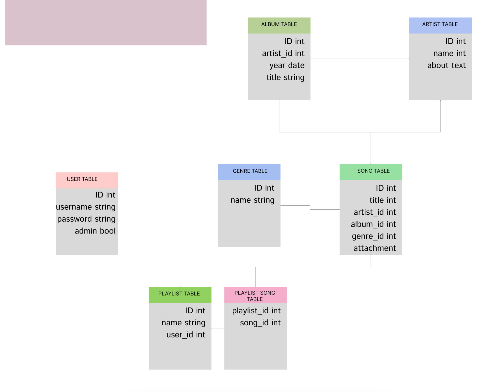
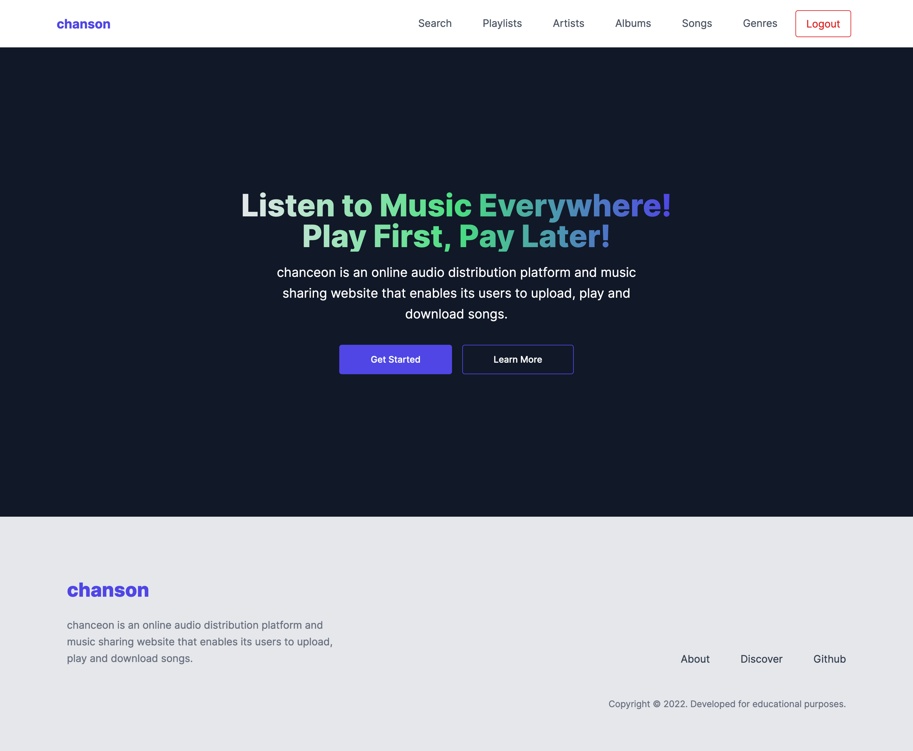
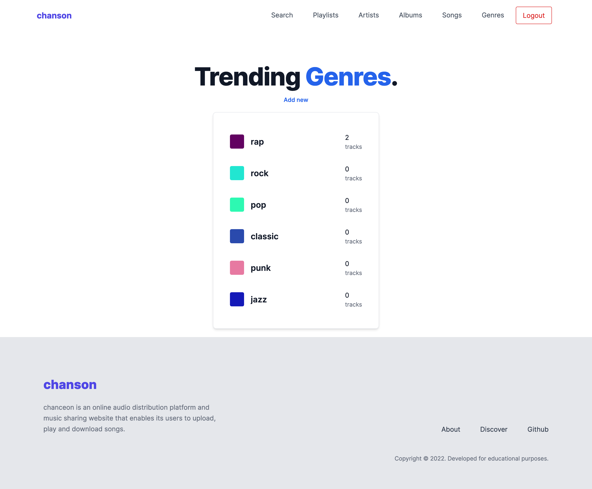
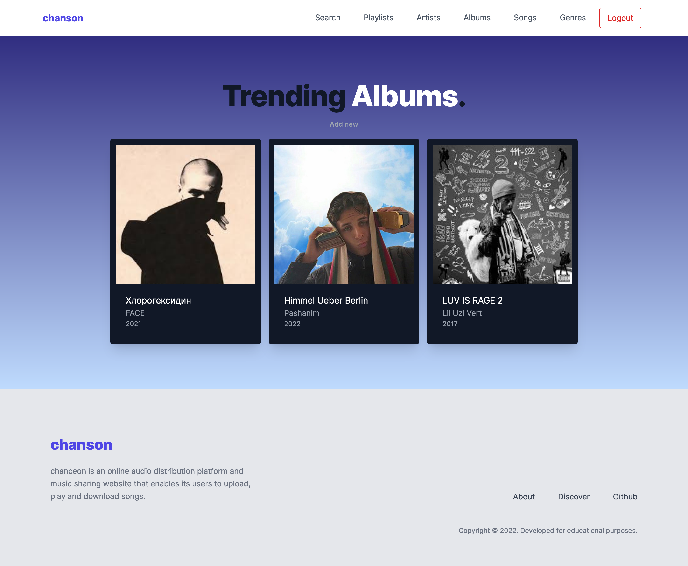
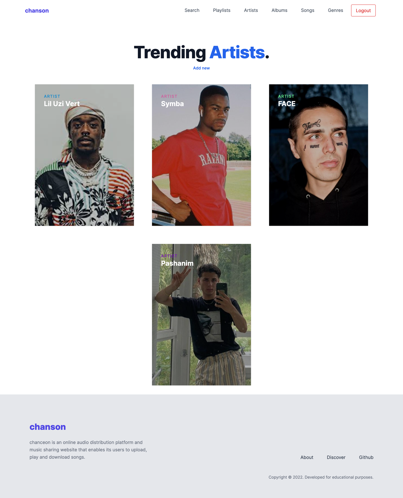
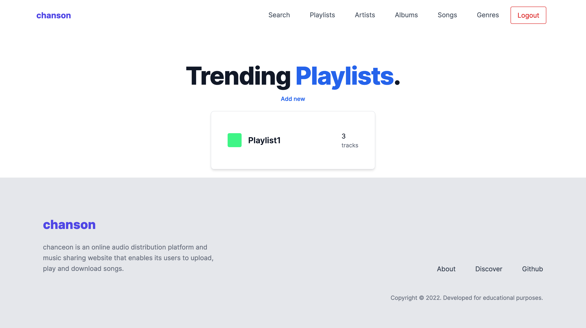

# music sharing service (university lab-assignment)

# ЛАБОРАТОРНАЯ РАБОТА 2

* Основная часть:
Необходимо разработать много-пользовательское программное приложение, предоставляющее следующий функционал:
Предоставить возможность каждому пользователю создавать, хранить и редактировать списки музыкальных композиций (трэков) и управлять ими.
Предоставить возможность каждому пользователю объединять музыкальные трэки (песни) в каталоги (playlists).
Реализовать возможность поиска музыкальных композиций и каталогов по различным критериям: исполнитель, название альбома, жанр, название композиции и т.д.

* Обязательная часть:
Разработать и реализовать базу данных для хранения всех необходимых данных (музыкальные композиции, исполнители, альбомы, плэй-листы пользователей и тд.).
Написать sql-скрипт для создания структуры БД.
Реализовать доступ к базе данных с использованием объектно-реляционного отображения (Object-relational mapping - ORM). 
В качестве ОРМ можно использовать LINQ to Entyties, Hibernate/nHibernate, Castle Active Record или любую другую ОРМ. 
Разработанное программное обеспечение должно реализовывать все пункты (1-3) перечисленные выше.
Разработанное ПО должно исключать возможность SQL-инъекций (SQL-injections).

* Дополнительная часть:
Реализовать возможность не только хранить и отображать информацию о музыкальных композициях, но проигрывать медиа-файлы :-).
Отделить пользовательский интерфейс от бизнес-логики.

# DB SCHEMA

# UI

